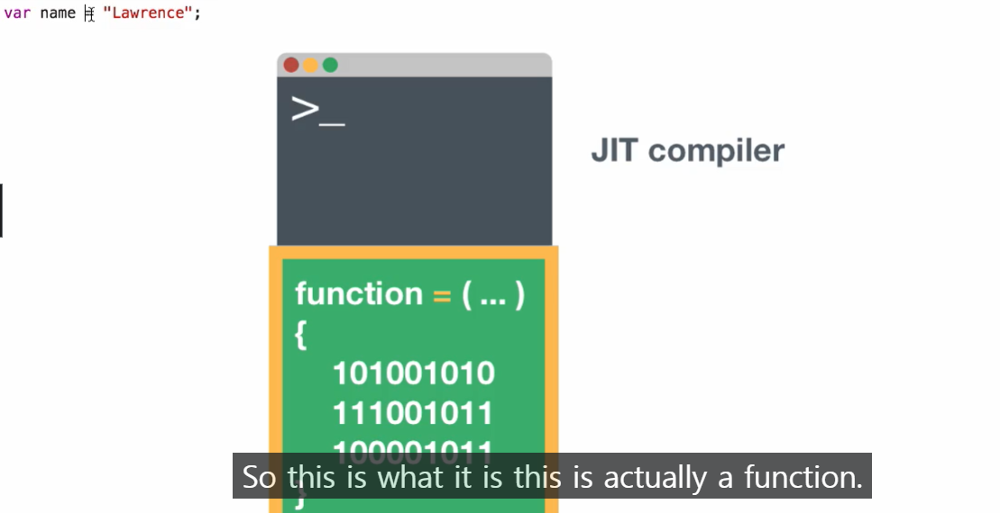

- Udemy 무료 JS강의[[https://www.udemy.com/course/javascript-essentials](https://www.udemy.com/course/javascript-essentials)] 를 보고 복기용으로 타이핑하는 수업내용.
- 자동생성된 영어 자막을 보며, 필요한 부분에 대한 내용만을 편집 하고 재타이핑 했기 때문에 일부 단어나 문구가 틀릴 수 있다.
- 이 JS강의를 들으며 놓쳤던 기초 부분을 복습하고 탄탄히 한다.
- 이 페이지에 있는 영어문장과 캡쳐 이미지의 저작권은(당연히) 모두 원작자 [Lawrence Turton](https://www.udemy.com/user/lawrenceturton/)와 [강의 사이트](https://www.udemy.com/course/javascript-essentials)에 있음을 명시한다.

### Operator



Well an operator is a predefined function for the language.
It's a function defined in the JIT compiler. It will read through your code and when it reaches an operator it will actually run a function.

Well with the JIT compiler It's actually got these operators pre-defined, ready to be executed in memory. And it can be run right in memory so it's predefined functionality. It's a predefined subroutine just like you going downstairs performing an action like making a cup of coffee.

Of course an operator is a task something you're asking the compiler to do. And It is a Function.

### B O DM AS

And so this is how I remember the operators in a mathematical statement and the order in which they are executed.

Brackets, pOwers(functions), DivisionMultiplication(\*/), AdditionSubstraction(+-)

```toc

```
